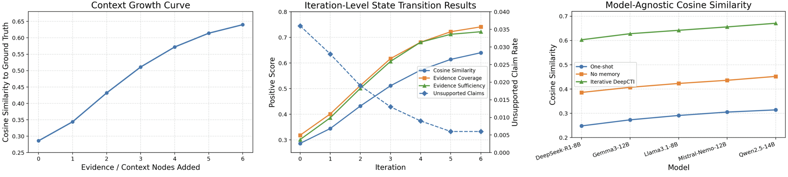

# DeepCTI: An Agentic Framework for Cyber Threat Intelligence Mitigation

[](#requirements)
[](#ollama-models)
[](#license)

This repository contains the dataset, implementation, prompts, evaluation scripts, and paper-ready result artifacts for **DeepCTI: An Agentic Framework for Cyber Threat Intelligence Mitigation**.

DeepCTI is an agentic cyber threat intelligence (CTI) mitigation-analysis framework for producing evidence-grounded mitigation recommendations. The framework compares three execution modes—one-shot generation, no-memory staged generation, and iterative evidence-preserving DeepCTI—over a 100-case local-intelligence evaluation dataset.

---

## Repository contents

```text
DeepCTI-main/
├── Dataset.xlsx                         # 100-case evaluation workbook
├── Metric Definitions.md                # Metric definitions used in the paper
├── README.md                            # Original repository README
├── Run.cmd                              # Windows dependency installation helper
├── Run_All.cmd                          # Windows all-model reproduction helper
├── requirements.txt                     # Python dependencies
├── src/
│   └── deepcti/
│       ├── __init__.py
│       ├── dataset.py                   # Excel dataset loader and column parsing
│       ├── embedding_utils.py           # SentenceTransformer embedding utilities
│       ├── evaluate_suggested.py        # Evaluation and paper-table generation
│       ├── ollama_client.py             # Local Ollama API wrapper
│       ├── prompts.py                   # Prompt templates and dry-run answer generator
│       └── run_experiment.py            # Main experiment runner
└── FinalDeepCTIResults/
    ├── DeepCTIFramework.png             # Framework figure
    ├── DeepIterations.png               # Iterative-state figure
    ├── table1_framework_level_results.csv
    ├── table2_semantic_scorer_evaluation.csv
    ├── table3_model_agnostic_deepcti_results.csv
    ├── table4_cosine_similarity_by_embedding_model.csv
    ├── table5_state_transition_iteration_trace.csv
    ├── table6_stopping_iteration_summary.csv
    └── table7_metric_definitions.csv
```

---

## Framework overview

DeepCTI evaluates whether iterative evidence accumulation improves mitigation recommendations compared with single-step generation. Each case contains CTI context, local environment information, baseline mitigation text, staged evidence updates, and a validated reference mitigation target.



The implementation supports three modes:

| Mode | Description |
|---|---|
| `one_shot` | Uses the initial CTI and local context only. |
| `no_memory` | Uses the latest staged evidence without reconstructing the accumulated evidence trace. |
| `iterative` | Preserves staged evidence, updates the mitigation state, verifies support, and generates a final recommendation. |

The generated output is required to include:

1. a compact final mitigation target,
2. evidence used,
3. rationale for the mitigation, and
4. a verification/stopping decision.

---

## Dataset

The workbook `Dataset.xlsx` contains the evaluation data used by the experiment runner.

Important sheets include:

| Sheet | Purpose |
|---|---|
| `DeepCTI_Run_Input` | Main 100-case input table used by `run_experiment.py`. |
| `Evaluation_Metadata` | Case family, target application, vulnerability class, evidence nodes, rubric fields, and scoring notes. |
| `Run_Protocol` | Protocol metadata for reproduction. |
| `Column_Guide` | Human-readable column descriptions. |
| `Evaluation_Design` | Experimental design notes. |
| `Metric_Mapping` | Mapping between generated/reference text and evaluation metrics. |

The loader in `src/deepcti/dataset.py` automatically detects key columns such as `Questions`, `Baseline_Mitigation`, staged evidence columns, and reference target columns such as `Evaluation_Target_Text` or `Final_Mitigation_Reference`.

---

## Requirements

Recommended environment:

- Python 3.10 or newer
- Windows PowerShell, Command Prompt, macOS shell, or Linux shell
- Local [Ollama](https://ollama.com/) server for full model runs
- Enough disk space and memory for local LLMs and SentenceTransformer embedding models

Python packages are listed in `requirements.txt`:

```text
pandas
openpyxl
numpy
scikit-learn
sentence-transformers
matplotlib
requests
jinja2
rank-bm25
```

---

## Installation

### Option 1: Windows helper script

```bat
Run.cmd
```

### Option 2: Manual installation

```bash
python -m venv .venv
source .venv/bin/activate        # macOS/Linux
# .venv\Scripts\activate         # Windows PowerShell
python -m pip install --upgrade pip
python -m pip install -r requirements.txt
```

Set the source path before running modules directly:

```bash
export PYTHONPATH="$PWD/src"      # macOS/Linux
# set PYTHONPATH=%CD%\src          # Windows cmd.exe
# $env:PYTHONPATH="$PWD\src"       # Windows PowerShell
```

---

## Quick smoke test

A dry run does not call an LLM. It verifies that dataset loading, prompt construction, JSONL writing, and mode handling are working.

```bash
PYTHONPATH=src python -m deepcti.run_experiment \
  --data-path Dataset.xlsx \
  --out-dir runs/smoke_test \
  --modes one_shot,iterative \
  --max-cases 2 \
  --dry-run \
  --no-resume
```

Expected outputs:

```text
runs/smoke_test/
├── predictions.jsonl
├── errors.jsonl
└── run_log.txt
```

---

## Running experiments with Ollama

Start Ollama before running full experiments:

```bash
ollama serve
```

Pull the local models used in the paper experiments or replace them with model tags available in your local Ollama registry:

```bash
ollama pull llama3.1:8b
ollama pull qwen2.5:14b
ollama pull mistral-nemo:12b
ollama pull gemma3:12b
ollama pull deepseek-r1:8b
```

The default model list in `run_experiment.py` is:

```text
gemma4:e4b, llama3.1:8b, qwen2.5:14b, mistral-nemo:12b, gemma3:12b, deepseek-r1:8b
```

> Check local availability of each Ollama tag before running. If a tag is unavailable, pass a comma-separated replacement list through `--models`.

Example single-model run:

```bash
PYTHONPATH=src python -m deepcti.run_experiment \
  --data-path Dataset.xlsx \
  --out-dir runs/llama31_8b \
  --models llama3.1:8b \
  --modes one_shot,no_memory,iterative \
  --no-resume
```

Useful options:

| Option | Meaning |
|---|---|
| `--data-path` | Path to the Excel workbook. Use `Dataset.xlsx` for this archive. |
| `--out-dir` | Directory where predictions, errors, and logs are written. |
| `--models` | Comma-separated Ollama model tags. |
| `--modes` | Comma-separated modes: `one_shot`, `no_memory`, `iterative`. |
| `--max-cases` | Optional limit for debugging or ablation runs. |
| `--dry-run` | Uses deterministic placeholder output instead of calling Ollama. |
| `--no-resume` | Deletes existing prediction/error files before starting. |
| `--timeout` | Ollama request timeout in seconds. Default: `900`. |

---

## Full reproduction workflow

### 1. Generate predictions

Run each model and append all predictions into a combined JSONL file. The Windows helper `Run_All.cmd` automates this workflow.

For a portable shell workflow:

```bash
mkdir -p runs
: > runs/combined_all_models_predictions.jsonl

for model in llama3.1:8b qwen2.5:14b mistral-nemo:12b gemma3:12b deepseek-r1:8b; do
  safe=$(echo "$model" | tr ':.-' '___')
  ollama pull "$model"
  PYTHONPATH=src python -m deepcti.run_experiment \
    --data-path Dataset.xlsx \
    --out-dir "runs/${safe}_suggested_full" \
    --models "$model" \
    --modes one_shot,no_memory,iterative \
    --no-resume
  cat "runs/${safe}_suggested_full/predictions.jsonl" >> runs/combined_all_models_predictions.jsonl
done
```

### 2. Evaluate predictions

```bash
PYTHONPATH=src python -m deepcti.evaluate_suggested \
  --predictions runs/combined_all_models_predictions.jsonl \
  --out-dir runs/combined_suggested_eval
```

Expected evaluation outputs:

```text
runs/combined_suggested_eval/
├── case_metrics_by_embedding.csv
├── semantic_similarity_by_embedding_and_mode.csv
├── summary_by_mode.csv
├── summary_by_llm_model_and_mode.csv
├── thresholded_match_f1.csv
├── thresholded_match_f1_pivot.csv
├── iteration_distribution.csv
└── paper_ready_tables.tex
```

---

## Evaluation metrics

DeepCTI reports semantic-alignment, retrieval, stopping, and robustness metrics.

| Metric | Purpose | Direction |
|---|---|---|
| Mean cosine semantic similarity | Embedding-based similarity between generated mitigation target and validated reference target. | Higher is better |
| Thresholded match F1 | F1 after converting cosine similarity into binary match/non-match labels. | Higher is better |
| Evidence coverage | Fraction of relevant evidence nodes retrieved and used. | Higher is better |
| Evidence reliability | Fraction of cited evidence supporting final claims. | Higher is better |
| Evidence sufficiency | Whether cumulative top-p evidence mass supports stopping. | Higher is better |
| Iteration count | Number of selected evidence chunks/state transitions. | Reported for trace analysis |
| Unsupported claims | Unsupported or hallucinated claims in the generated mitigation. | Lower is better |

Important interpretation:

- Cosine similarity is a continuous semantic-alignment score, not an F1 score.
- Match F1 is computed only after thresholding cosine similarity.
- Negative controls are created by pairing generated outputs with the wrong reference target so that true negatives and false positives are meaningful.
- Evaluation uses the embedding models defined in `src/deepcti/embedding_utils.py` by default:
  - `sentence-transformers/all-MiniLM-L6-v2`
  - `sentence-transformers/all-mpnet-base-v2`
  - `intfloat/e5-base-v2`

---

## Included paper result artifacts

The directory `FinalDeepCTIResults/` contains static exported tables and figures for manuscript preparation.

| File | Description |
|---|---|
| `DeepCTIFramework.png` | Framework diagram. |
| `DeepIterations.png` | Iterative evidence/state-transition diagram. |
| `table1_framework_level_results.csv` | Framework-level comparison across one-shot, no-memory, and iterative DeepCTI. |
| `table2_semantic_scorer_evaluation.csv` | Semantic scorer/retriever evaluation. |
| `table3_model_agnostic_deepcti_results.csv` | Model-agnostic robustness results. |
| `table4_cosine_similarity_by_embedding_model.csv` | Cosine similarity by embedding model. |
| `table5_state_transition_iteration_trace.csv` | Iteration/state transition trace. |
| `table6_stopping_iteration_summary.csv` | Stopping iteration summary. |
| `table7_metric_definitions.csv` | Metric definitions for reporting. |

For a regenerated run, cite the files produced under `runs/combined_suggested_eval/`. For the manuscript snapshot, cite the exported files in `FinalDeepCTIResults/`.

---

## Implementation notes

### Dataset loading

`dataset.py` reads `Dataset.xlsx`, selects the `DeepCTI_Run_Input` sheet when present, detects the analyst question, baseline mitigation, staged evidence, and reference target columns, and returns a list of `Case` objects.

### Prompting

`prompts.py` defines a shared system instruction and mode-specific context construction. The prompt requires the model to ground recommendations only in supplied CTI evidence and local context.

### LLM backend

`ollama_client.py` sends non-streaming generation requests to:

```text
http://localhost:11434/api/generate
```

The default generation temperature is `0.1`, and the default context window parameter is `num_ctx=8192`.

### Evaluation

`evaluate_suggested.py` reads prediction JSONL records, computes embedding similarity between generated and reference mitigation targets, constructs shifted-reference negative controls, estimates retrieval sufficiency, summarizes mode-level and model-level results, and exports CSV and LaTeX tables.

---

## Reproducibility checklist

Before submitting or publishing this repository, verify the following:

- [ ] `Dataset.xlsx` is the intended anonymized/public-release dataset.
- [ ] Model tags in commands are available through the installed Ollama version.
- [ ] `Run_All.cmd` points to `Dataset.xlsx`, not an older dataset filename.
- [ ] Regenerated outputs match the values reported in the manuscript or differences are documented.
- [ ] `FinalDeepCTIResults/` contains the exact figures/tables used in the paper.
- [ ] The final paper title, author list, venue, DOI, and citation are added below.
- [ ] The project license is explicitly stated.

---

## Troubleshooting

### `Dataset not found`

Use the dataset name included in this archive:

```bash
--data-path Dataset.xlsx
```

### `Connection refused` from Ollama

Start the Ollama service:

```bash
ollama serve
```

Then confirm that the model exists locally:

```bash
ollama list
```

### SentenceTransformer model download fails

The first evaluation run downloads embedding models. Make sure the environment has network access or pre-cache the models before running evaluation.

### Out-of-memory during local LLM inference

Use a smaller model, run one model at a time, reduce concurrent processes, or limit cases with `--max-cases` for debugging.

### Empty predictions file

Check `runs/<run_name>/errors.jsonl` and `runs/<run_name>/run_log.txt`. The experiment runner raises an error if no predictions are written.

---


## Contact

For questions about the paper artifact, open an issue in the repository or contact the corresponding author listed in the publication.
